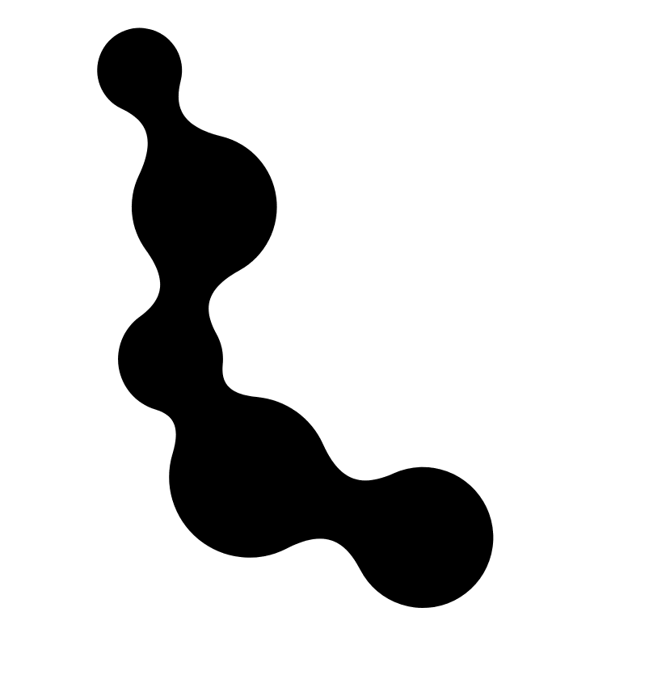
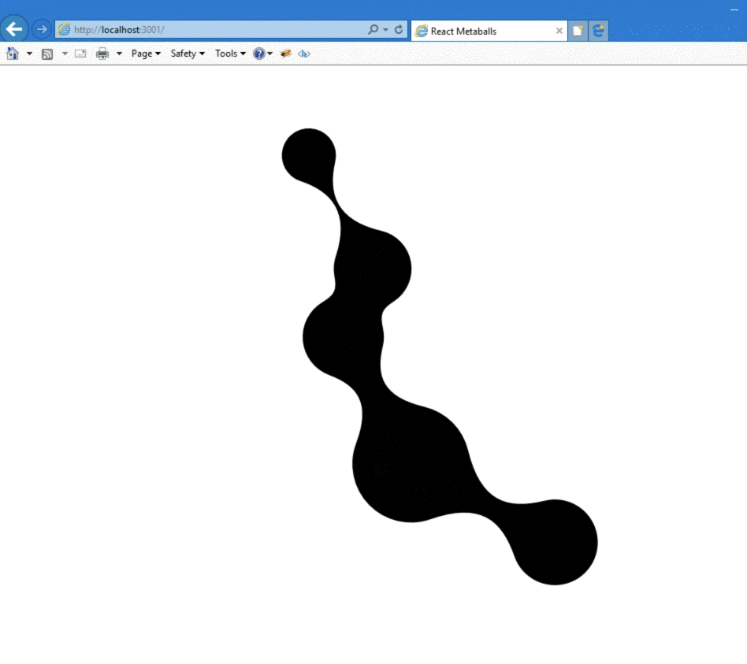
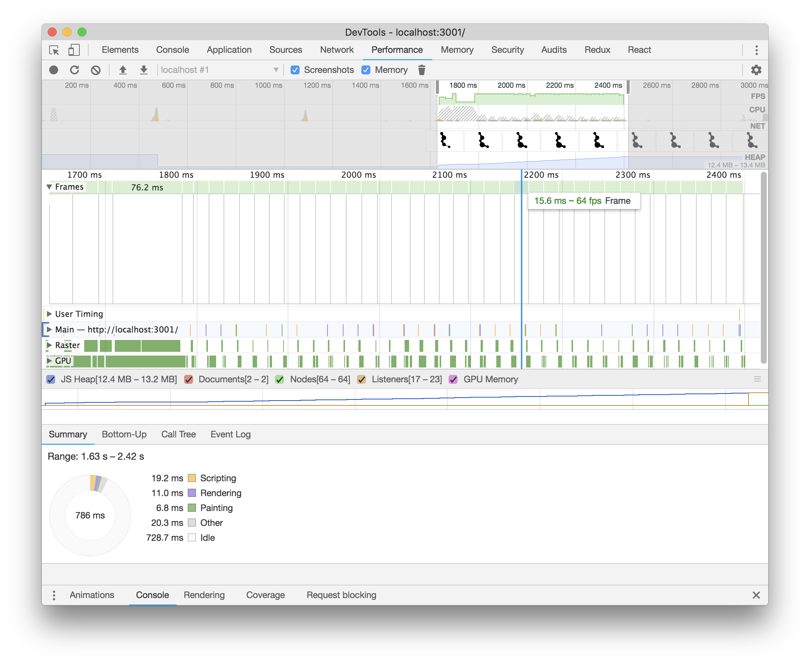

# React Metaballs

Data-driven React component rendering SVG metaballs, animated using d3.  

[](https://www.npmjs.com/package/react-metaballs) [](https://standardjs.com)

## Example

See a [demo here](https://tombarr.github.io/react-metaballs/index.html)



## Install

```bash
npm install --save react-metaballs
```

## Usage

```jsx
import React, { Component } from 'react'

import ReactMetaballs from 'react-metaballs'

const circles = [
  {
    cx: 200,
    cy: 100,
    r: 64
  },
  {
    cx: 300,
    cy: 300,
    r: 96
  },
  {
    cx: 250,
    cy: 475,
    r: 56
  },
  {
    cx: 350,
    cy: 675,
    r: 128
  },
  {
    cx: 600,
    cy: 800,
    r: 76
  }
]

class Example extends Component {
  render () {
    return (
      <Metaballs
        ref={this.metaballs}
        easement={d3.easeBackOut}
        circles={circles} />
    )
  }
}
```

## Compatibility

Tested on modern browsers and IE 11.



## Performance

Basic testing shows the SVG path animation is able to comfortably perform at or above 60fps.



## License

MIT © [Tombarr](https://github.com/Tombarr)
